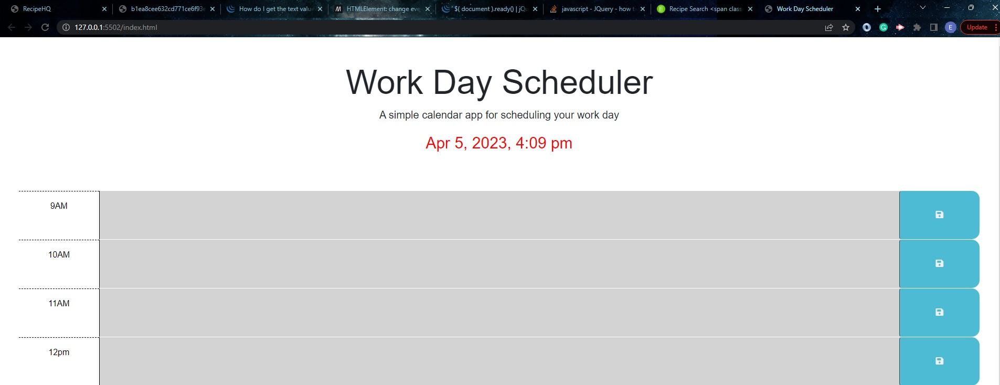
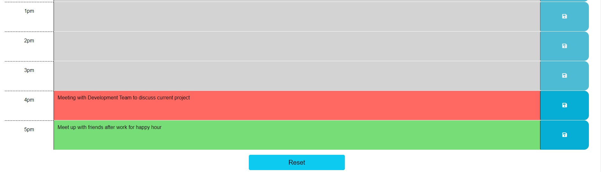

# work-day-scheduler

## Daily Work Day Calendar
It is a daily work scheduler that start at 9am and ends at 5pm. It allows users to enter hourly schedule within the mentioned time above. It is a comprehensive daily scheduler that helps users to plan their day. It is a color coding that depicts the past, present, and future within the day. After 5 pm, all the time slots will be in the future for the next day. It allows users to plan their day ahead. In the course of the day users can reset the scheduler for all the time slots.

## Usage

The user is presented with a work day scheduler with time slots from 9am to 5pm. Each time slot will have a color code depending the current time. If the time slot is in the past per the current time the color for it will be grey and the field will be disabled. If it is present, meaning the time slot is the same as the hour of the current hour,the time slot will be red. If it is in the future, thus the time slots greater than the current hour, the slot will be color-coded green. 

After 5pm all the time slots turns to green, meaning it resets for the user to schedule for next day and will be editable till the time slots gets in the past. Also, there is a reset button for the user to clear data and reset the time slots for new entry.

## Technology Used
- HTML
- CSS
- JavaScript
- JQuery
- BootStrap

Below is the link to the deployed application

https://eugenestar5.github.io/work-day-schedule/